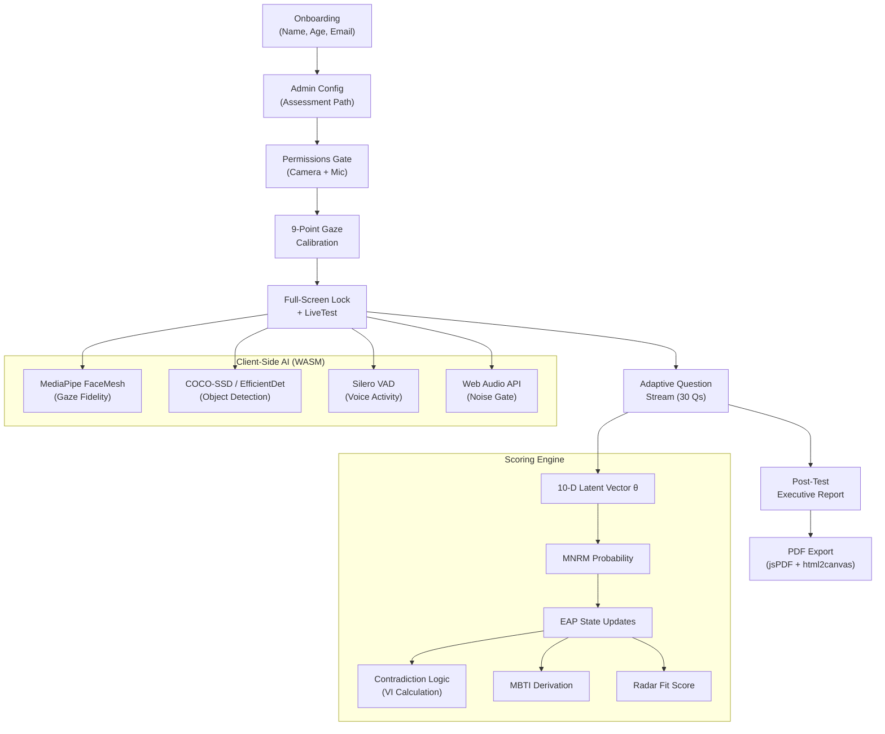

# Psychometric & Multimodal Proctoring Platform — Next.js Rebuild

Rebuild the existing Vite+React psychometric platform as a production-grade Next.js App Router application with dark glassmorphism UI, advanced scoring mathematics, and hyper-secure client-side proctoring.

## User Review Required

> [!IMPORTANT]
> **Stack migration**: This is a full rebuild from Vite+React → Next.js 15 (App Router) in `Psych_2`. All proven logic (30-question psychometric engine, MediaPipe vision, audio surveillance, ghost metrics) will be ported from the existing `Psych` project and refactored to match the new architecture.

> [!WARNING]
> **Client-Side Heavy**: TensorFlow.js COCO-SSD, MediaPipe FaceMesh, and Silero VAD are all client-side WASM models. These require `Cross-Origin-*` headers and will only work in Chromium browsers. Safari/Firefox support is limited.

> [!IMPORTANT]
> **Tailwind CSS 4**: The user's existing project uses Tailwind v4. I'll use Tailwind v4 (PostCSS) with the Next.js project for the dark glassmorphism aesthetic.

## Open Questions

> [!IMPORTANT]
> **9-Point vs 4-Point Calibration**: The system prompt mentions "4 bounding points" in Phase 1 but the attachment specifies "9-point screen calibration." I'll implement the **9-point calibration** as specified in the attachment (more accurate baseline). Confirm if you prefer the simpler 4-point version.

> [!IMPORTANT]
> **Deepgram Dependency**: The existing `Psych` project uses Deepgram Nova-3 for audio (a paid service). The new spec mandates **zero-cost** client-side audio via Web Audio API + Silero VAD WASM. I'll replace Deepgram entirely with the zero-cost AudioWorklet + Silero VAD pipeline. Confirm this is correct.

> [!IMPORTANT]
> **30 Questions Only**: The spec says "stream questions 1 to 30 sequentially." The existing project has 30 psychometric scenarios + engineering templates. I'll port the 30 psychometric mindset bank as the primary question set and keep the engineering template system as an option. The "adaptive streaming API" will be a Next.js API route that serves questions based on the real-time psychometric state.

---

## Architecture Overview



---

## Proposed Changes

### Component 1: Project Scaffolding & Design System

#### [NEW] Next.js Project Initialization
- Initialize Next.js 15 with App Router in `Psych_2` using `npx create-next-app@latest`
- Configure: TypeScript OFF (JS), Tailwind CSS ON, App Router ON, src/ directory ON
- Install dependencies: `framer-motion`, `lucide-react`, `zustand`, `jspdf`, `html2canvas`, `@mediapipe/tasks-vision`, `onnxruntime-web`

#### [NEW] [globals.css](file:///c:/Users/dhiva/OneDrive/Desktop/Projects/Psych_2/src/app/globals.css)
- Dark glassmorphism design system with CSS custom properties
- Monochromatic dark grayscale palette with ultra-premium cyan/violet accents
- Glass card utility classes (`backdrop-blur-md`, `border-white/10`, deep canvas shadows)
- Custom `@font-face` for Inter/Outfit from Google Fonts
- Smooth micro-animation keyframes (entrance, pulse, glow, shimmer)
- Progress ring and radar chart CSS utilities

#### [NEW] [layout.js](file:///c:/Users/dhiva/OneDrive/Desktop/Projects/Psych_2/src/app/layout.js)
- Root layout with dark theme, SEO meta tags, font loading
- `<html className="dark">` with proper `lang`, `title`, `description`

#### [NEW] [next.config.mjs](file:///c:/Users/dhiva/OneDrive/Desktop/Projects/Psych_2/next.config.mjs)
- COOP/COEP headers for SharedArrayBuffer (MediaPipe WASM)
- WebAssembly webpack config for ONNX runtime

---

### Component 2: State Management (Zustand)

#### [NEW] [src/store/useAppStore.js](file:///c:/Users/dhiva/OneDrive/Desktop/Projects/Psych_2/src/store/useAppStore.js)
- Global app state with Zustand + `persist` middleware (localStorage)
- Slices: `step` (login→admin→instructions→permissions→calibration→test→results→invalidated), `userMeta` (email, name, age, background), `testConfig`, `results`
- Session recovery on page reload

#### [NEW] [src/store/useProctoringStore.js](file:///c:/Users/dhiva/OneDrive/Desktop/Projects/Psych_2/src/store/useProctoringStore.js)
- Proctoring state machine: `warnings` (0-3), `terminated`, `fullscreenExits` (0-2)
- Infraction log: `{type, timestamp, questionId, proof?}`
- Auto-terminate on 4th infraction or 2nd fullscreen exit

#### [NEW] [src/store/useTelemetryStore.js](file:///c:/Users/dhiva/OneDrive/Desktop/Projects/Psych_2/src/store/useTelemetryStore.js)
- Per-question telemetry: `renderTime`, `firstClickTime`, `optionFlips[]`, `pointerVelocities[]`, `hoverTime`, `decisionFriction`
- Decision friction formula: `F = w₁(1-PE) + w₂·log(1+N_sw) + w₃·log(1+T_hover)`
- Baseline calibration (first 2-3 untimed questions)
- Pointer velocity anomaly detection (>5 vector flips = "High Decision Friction")

#### [NEW] [src/store/useScoringStore.js](file:///c:/Users/dhiva/OneDrive/Desktop/Projects/Psych_2/src/store/useScoringStore.js)
- 10-dimensional latent vector θ = (O,C,E,A,N,EQ_sa,EQ_sr,EQ_mo,EQ_em,EQ_ss)
- EAP posterior state updates after each response
- MNRM probability calculation
- Contradiction pair tracking and Validity Index (VI)
- MBTI derivation from Big Five correlates

---

### Component 3: Onboarding Flow

#### [NEW] [src/app/page.js](file:///c:/Users/dhiva/OneDrive/Desktop/Projects/Psych_2/src/app/page.js)
- Client component orchestrator that reads `step` from Zustand and renders the appropriate phase
- Dark glass background with animated gradient orbs

#### [NEW] [src/components/Onboarding.jsx](file:///c:/Users/dhiva/OneDrive/Desktop/Projects/Psych_2/src/components/Onboarding.jsx)
- Captures: Name, Age, Email, Background (role/department)
- Glassmorphic input fields with floating labels
- Framer Motion staggered entrance animations
- Validates email format, Name ≥ 2 chars, Age 16-99

#### [NEW] [src/components/AdminConfig.jsx](file:///c:/Users/dhiva/OneDrive/Desktop/Projects/Psych_2/src/components/AdminConfig.jsx)
- Port from existing `Psych/AdminConfig.jsx`, re-styled with dark glassmorphism
- Assessment path selection (Psychometric / Engineering)
- Engineering domain dropdown with search
- Difficulty selector (segmented control)

#### [NEW] [src/components/Instructions.jsx](file:///c:/Users/dhiva/OneDrive/Desktop/Projects/Psych_2/src/components/Instructions.jsx)
- Port from existing, dark theme restyling
- Clear rules about fullscreen enforcement, proctoring, time limit

---

### Component 4: Permissions & Calibration

#### [NEW] [src/components/PermissionsGate.jsx](file:///c:/Users/dhiva/OneDrive/Desktop/Projects/Psych_2/src/components/PermissionsGate.jsx)
- Step-by-step modal: Camera → Microphone
- Dark glassmorphic card with animated status indicators
- Privacy notice (all processing is local, zero data transmission)

#### [NEW] [src/components/GazeCalibration.jsx](file:///c:/Users/dhiva/OneDrive/Desktop/Projects/Psych_2/src/components/GazeCalibration.jsx)
- **9-point screen calibration**: User clicks/tracks dots at 9 positions (3×3 grid)
- Each point: animates to position → user fixates → 1s capture → next point
- Stores iris-to-screen mapping offsets for gaze fidelity baseline
- Framer Motion dot animations with glowing pulse effect
- ~5-second total routine (each point < 600ms)

---

### Component 5: Full-Screen & Proctoring State Machine

#### [NEW] [src/hooks/useFullscreenLock.js](file:///c:/Users/dhiva/OneDrive/Desktop/Projects/Psych_2/src/hooks/useFullscreenLock.js)
- Programmatically enters fullscreen via Fullscreen API on test start
- Listens to `fullscreenchange` and `visibilitychange` events
- **1st exit**: Warning modal (must re-enter fullscreen within 10s)
- **2nd exit**: Immediate session termination → "Test Invalidated" state
- Tab switch detection via `document.hidden`

#### [NEW] [src/hooks/useVisionSurveillance.js](file:///c:/Users/dhiva/OneDrive/Desktop/Projects/Psych_2/src/hooks/useVisionSurveillance.js)
- **Port from existing** `Psych/hooks/useVisionSurveillance.js` with enhancements:
  - MediaPipe FaceLandmarker for gaze tracking (WebGL/WASM delegate)
  - EfficientDet Lite0 for object detection (COCO-SSD equivalent)
  - Gaze threshold: 2.5s sustained off-screen → infraction
  - Multi-person: >1 face sustained 500ms → infraction + snapshot
  - Contraband: cell phone, laptop, book, TV, remote → infraction + snapshot
  - Throttle: 1-2fps inference on alternating frames
  - Proof frame capture: in-memory JPEG data URL (max 5 per session)

#### [NEW] [src/hooks/useAudioSurveillance.js](file:///c:/Users/dhiva/OneDrive/Desktop/Projects/Psych_2/src/hooks/useAudioSurveillance.js)
- **Zero-cost replacement** for Deepgram:
  - Web Audio API AnalyserNode as noise gate (ambient threshold calibrated at start)
  - If noise > ambient threshold: pass audio buffer to Silero VAD WASM model
  - Silero VAD detects human speech vs. background noise
  - Speech detected → infraction + log timestamp
  - AudioWorklet for off-thread processing

#### [NEW] [src/hooks/useGhostMetrics.js](file:///c:/Users/dhiva/OneDrive/Desktop/Projects/Psych_2/src/hooks/useGhostMetrics.js)
- Port from existing with enhancements:
  - ms-precision timestamps: question render → first click
  - Option flip tracking with direction vectors
  - Pointer velocity calculation with vector flip counting
  - "High Decision Friction (Jitters)" flag at >5 vector flips without selecting

---

### Component 6: Live Test Canvas

#### [NEW] [src/components/LiveTest.jsx](file:///c:/Users/dhiva/OneDrive/Desktop/Projects/Psych_2/src/components/LiveTest.jsx)
- Focus-driven, zero-distraction center card layout
- Smooth SVG progress ring showing question progress (1/30)
- Dynamic video-feed preview widget (bottom-right corner):
  - Live camera feed with gaze/object tracking vector overlay
  - Gaze status dot (green/amber/red)
  - Face count badge, contraband alert badges
- Fullscreen enforcement active
- 30-minute timer (configurable)
- Warning toast system with Framer Motion animations

#### [NEW] [src/components/QuestionCard.jsx](file:///c:/Users/dhiva/OneDrive/Desktop/Projects/Psych_2/src/components/QuestionCard.jsx)
- Dark glass card with glowing modern option buttons
- Option hover: subtle glow + scale animation
- Selected option: cyan accent border + fill
- Radio-button style selection with animated indicators
- Voice dictation button for `requires_logic` questions (Web Speech API)
- Tracks all telemetry (hover, click, option flips) via ghost metrics

#### [NEW] [src/components/WarningToast.jsx](file:///c:/Users/dhiva/OneDrive/Desktop/Projects/Psych_2/src/components/WarningToast.jsx)
- Animated warning toast for proctoring infractions
- Shows infraction type icon + message
- Auto-dismiss after 4s
- Stack with max 3 visible

#### [NEW] [src/components/TerminatedScreen.jsx](file:///c:/Users/dhiva/OneDrive/Desktop/Projects/Psych_2/src/components/TerminatedScreen.jsx)
- "Test Invalidated Due to Breach" full-screen state
- Shows reason (fullscreen exit / 4 infractions)
- No retry option — session is permanently invalidated

---

### Component 7: Psychometric Scoring Engine

#### [NEW] [src/engine/scoringEngine.js](file:///c:/Users/dhiva/OneDrive/Desktop/Projects/Psych_2/src/engine/scoringEngine.js)
- **10-dimensional latent vector**: θ = (O,C,E,A,N,EQ_sa,EQ_sr,EQ_mo,EQ_em,EQ_ss) ∈ ℝ¹⁰
- **MNRM probability**: P(Y_i=k|θ) = exp(a_ik·θ - b_ik) / Σ exp(a_ij·θ - b_ij)
  - Each option has a 10-dimensional discrimination vector `a_ik` and difficulty scalar `b_ik`
  - Port existing traitWeights and expand to 10-D (split EI into 5 sub-dimensions)
- **EAP state update**: After each response, compute posterior θ using numerical integration
  - Prior: N(0, I) initially
  - Posterior updated via Bayes' rule over discrete grid
- **MBTI derivation**: Pure display layer mapped from Big Five
  - E-I: Extraversion (r≈0.74)
  - S-N: Openness (r≈0.72)
  - T-F: Agreeableness (r≈0.44)
  - J-P: Conscientiousness (r≈0.49)

#### [NEW] [src/engine/contradictionEngine.js](file:///c:/Users/dhiva/OneDrive/Desktop/Projects/Psych_2/src/engine/contradictionEngine.js)
- **Contradiction placement**: Probe questions placed k∈[5,9] intervals after original
- **Semantic mutation**: cos(E(q_n), E(q_{n+k})) < 0.30 (different surface text)
- **Trait alignment**: a_{q_n}·a_{q_{n+k}} > 0.80 (same underlying trait)
- **Validity Index**: VI = 1 - (1/P)·Σ|θ̂(n_p) - θ̂(n_p + k_p)|
- Pre-computed contradiction pairs from the 30-question bank (no runtime LLM needed)

#### [NEW] [src/engine/radarFitScore.js](file:///c:/Users/dhiva/OneDrive/Desktop/Projects/Psych_2/src/engine/radarFitScore.js)
- 6-axis competency mapping: Ethics, Teamwork, Leadership, EQ, Adaptability, Resilience
- Administrative benchmark vector b
- Candidate vector c derived from θ
- **Fit score**: Fit = λ·cos(c,b) + (1-λ)·(1 - ||c-b||₂ / (√6·100))
- λ = 0.6 default (tunable)

#### [NEW] [src/engine/decisionFriction.js](file:///c:/Users/dhiva/OneDrive/Desktop/Projects/Psych_2/src/engine/decisionFriction.js)
- Path efficiency PE = straight-line / actual pointer path
- Friction formula: F = w₁(1-PE) + w₂·log(1+N_sw) + w₃·log(1+T_hover)
- Baseline normalization from first 2-3 untimed questions
- Pointer velocity anomaly detection

---

### Component 8: Adaptive Question Stream API

#### [NEW] [src/app/api/questions/route.js](file:///c:/Users/dhiva/OneDrive/Desktop/Projects/Psych_2/src/app/api/questions/route.js)
- Next.js API Route (Edge Runtime compatible)
- Accepts POST with current θ state and question history
- Returns next question from the pool:
  - First 3: baseline questions (untimed, for decision friction calibration)
  - Questions 4-30: sequentially from shuffled pool with contradiction injection
  - Contradiction probes injected at k∈[5,9] intervals
- Stateless: all state lives client-side in Zustand

#### [NEW] [src/data/questionBank.js](file:///c:/Users/dhiva/OneDrive/Desktop/Projects/Psych_2/src/data/questionBank.js)
- Port all 30 psychometric mindset scenarios from existing `testGenerator.js`
- Expand traitWeights to 10-D vectors (a_ik) with MNRM-compatible format
- Add difficulty scalars (b_ik) for each option
- Pre-compute contradiction pairs with semantic distinctness markers

---

### Component 9: Executive Report Dashboard

#### [NEW] [src/components/report/ReportDashboard.jsx](file:///c:/Users/dhiva/OneDrive/Desktop/Projects/Psych_2/src/components/report/ReportDashboard.jsx)
- **Stunning corporate executive dashboard** with dark glassmorphism
- Sections:
  1. **Meta Section**: Total attempted/skipped, completion speed, global Performance Radar
  2. **Psychometric Deep Dive**: OCEAN, MBTI, SJT, EQ profiles with animated bar charts
  3. **Security Matrix**: Environment Integrity %, Gaze Fidelity %, Voice Integrity %, Decision Friction % — with snapshot proof images
  4. **Question-by-Question Diagnostic**: Choice, implication, comparative matrix of all options
  5. **Export Button**: "Download Certified PDF Report"

#### [NEW] [src/components/report/RadarChart.jsx](file:///c:/Users/dhiva/OneDrive/Desktop/Projects/Psych_2/src/components/report/RadarChart.jsx)
- Port and enhance existing SVG radar chart
- 6-axis: Ethics, Teamwork, Leadership, EQ, Adaptability, Resilience
- Animated fill on mount via Framer Motion
- Administrative benchmark overlay (dashed line)
- Dark theme with glowing accent colors

#### [NEW] [src/components/report/SecurityMatrix.jsx](file:///c:/Users/dhiva/OneDrive/Desktop/Projects/Psych_2/src/components/report/SecurityMatrix.jsx)
- 4 integrity gauges: Environment, Gaze, Voice, Decision Friction
- Color-coded: green (>90%), amber (70-90%), red (<70%)
- Expandable proof frame gallery for violations

#### [NEW] [src/components/report/QuestionDiagnostic.jsx](file:///c:/Users/dhiva/OneDrive/Desktop/Projects/Psych_2/src/components/report/QuestionDiagnostic.jsx)
- Per-question expandable cards
- Shows: chosen option + cognitive state implication
- Comparative matrix: what each other option would have indicated
- Trait weight impact badges

---

### Component 10: PDF Export Engine

#### [NEW] [src/services/pdfExport.js](file:///c:/Users/dhiva/OneDrive/Desktop/Projects/Psych_2/src/services/pdfExport.js)
- Client-side `jsPDF` + `html2canvas`
- Captures the full report layout as multi-page PDF
- Corporate executive formatting: headers, page numbers, watermark
- Includes radar chart, security matrix, question diagnostics
- Cryptographically tagged with session ID + timestamp
- Single-action "Download Certified PDF Report" button

---

### Component 11: Report Generation Service

#### [NEW] [src/services/reportGenerator.js](file:///c:/Users/dhiva/OneDrive/Desktop/Projects/Psych_2/src/services/reportGenerator.js)
- Port from existing `aiReportService.js` with major enhancements:
  - Uses new 10-D scoring engine instead of simple accumulation
  - Generates all 6 competency axes (Ethics, Teamwork, Leadership, EQ, Adaptability, Resilience)
  - Calculates Validity Index from contradiction pairs
  - Computes Radar Fit Score against administrative benchmark
  - **No clinical labels**: Strictly behavioral/occupational terminology
  - **No Xenova/Transformers dependency**: Remove NLP sentiment pipeline (reduces bundle by ~200MB)
  - Decision friction analysis from telemetry data

---

## File Structure

```
Psych_2/
├── src/
│   ├── app/
│   │   ├── layout.js          # Root layout, fonts, meta
│   │   ├── page.js            # Main orchestrator (client component)
│   │   ├── globals.css        # Dark glassmorphism design system
│   │   └── api/
│   │       └── questions/
│   │           └── route.js   # Adaptive question stream API
│   ├── components/
│   │   ├── Onboarding.jsx     # Name, Age, Email, Background
│   │   ├── AdminConfig.jsx    # Assessment path selection
│   │   ├── Instructions.jsx   # Test rules & info
│   │   ├── PermissionsGate.jsx # Camera + Mic permissions
│   │   ├── GazeCalibration.jsx # 9-point calibration
│   │   ├── LiveTest.jsx       # Test canvas with progress ring
│   │   ├── QuestionCard.jsx   # Glowing option buttons
│   │   ├── VisionProctor.jsx  # Camera feed widget
│   │   ├── WarningToast.jsx   # Infraction toast notifications
│   │   ├── TerminatedScreen.jsx # Session invalidated
│   │   └── report/
│   │       ├── ReportDashboard.jsx
│   │       ├── RadarChart.jsx
│   │       ├── SecurityMatrix.jsx
│   │       └── QuestionDiagnostic.jsx
│   ├── hooks/
│   │   ├── useFullscreenLock.js
│   │   ├── useVisionSurveillance.js
│   │   ├── useAudioSurveillance.js
│   │   └── useGhostMetrics.js
│   ├── store/
│   │   ├── useAppStore.js
│   │   ├── useProctoringStore.js
│   │   ├── useTelemetryStore.js
│   │   └── useScoringStore.js
│   ├── engine/
│   │   ├── scoringEngine.js
│   │   ├── contradictionEngine.js
│   │   ├── radarFitScore.js
│   │   └── decisionFriction.js
│   ├── data/
│   │   └── questionBank.js
│   └── services/
│       ├── reportGenerator.js
│       └── pdfExport.js
├── public/
│   └── (static assets)
├── next.config.mjs
├── tailwind.config.js
└── package.json
```

---

## Verification Plan

### Automated Tests
- `npm run build` — Verify zero build errors
- `npm run dev` — Verify dev server starts cleanly

### Manual Verification
1. **Onboarding**: Fill in Name/Age/Email/Background → verify dark glass UI
2. **Permissions**: Grant camera + mic → verify both status indicators update
3. **Calibration**: Complete 9-point gaze calibration → verify baseline stored
4. **Fullscreen**: Test enters fullscreen → exit once (warning) → exit again (terminated)
5. **Proctoring**: Look away >2.5s (gaze flag), add phone to frame (contraband flag), speak (audio flag)
6. **Questions**: Navigate 30 questions, verify adaptive streaming, option selection telemetry
7. **Report**: Verify radar chart, security matrix, OCEAN/MBTI/EQ profiles, question diagnostics
8. **PDF**: Click download → verify multi-page corporate PDF with all sections
9. **State Recovery**: Refresh mid-test → verify Zustand persists progress

---

## Execution Phases

| Phase | Description | Est. Files |
|-------|-------------|-----------|
| **Phase 1** | Project scaffolding, design system, layout, stores | 8 files |
| **Phase 2** | Onboarding, AdminConfig, Instructions, Permissions | 5 files |
| **Phase 3** | Gaze calibration, fullscreen lock, proctoring hooks | 5 files |
| **Phase 4** | Scoring engine, contradiction logic, decision friction | 4 files |
| **Phase 5** | Question bank, API route, LiveTest, QuestionCard | 5 files |
| **Phase 6** | Report dashboard, radar chart, security matrix, diagnostics | 5 files |
| **Phase 7** | PDF export, polish, verification | 3 files |

**Total: ~35 files, ~8000-10000 lines of code**

> [!CAUTION]
> This is a large build. I recommend approving this plan and then using `/goal` to let me execute it thoroughly without interruption.
